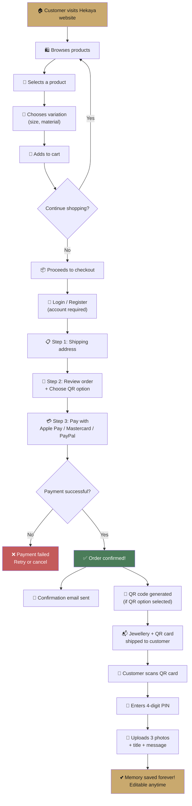
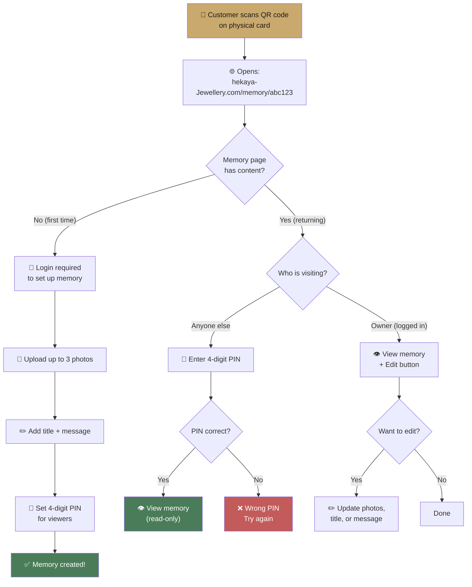
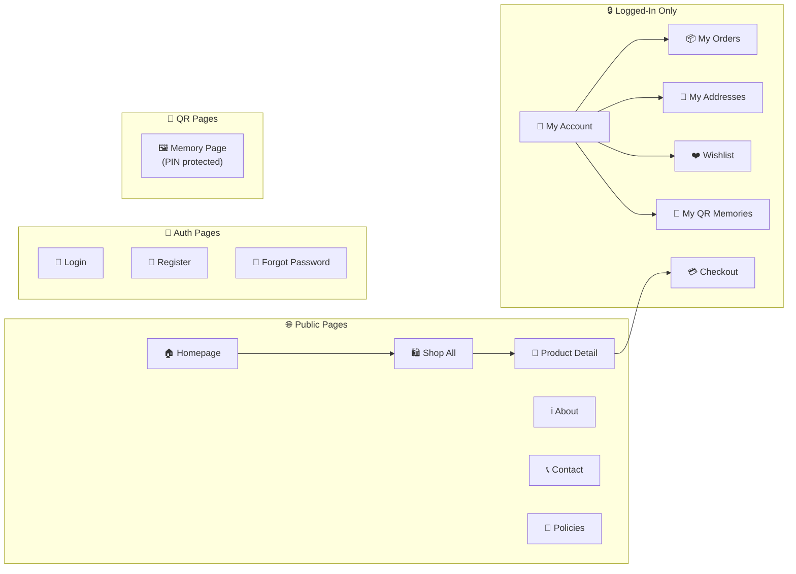
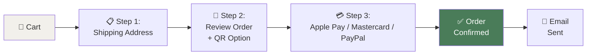
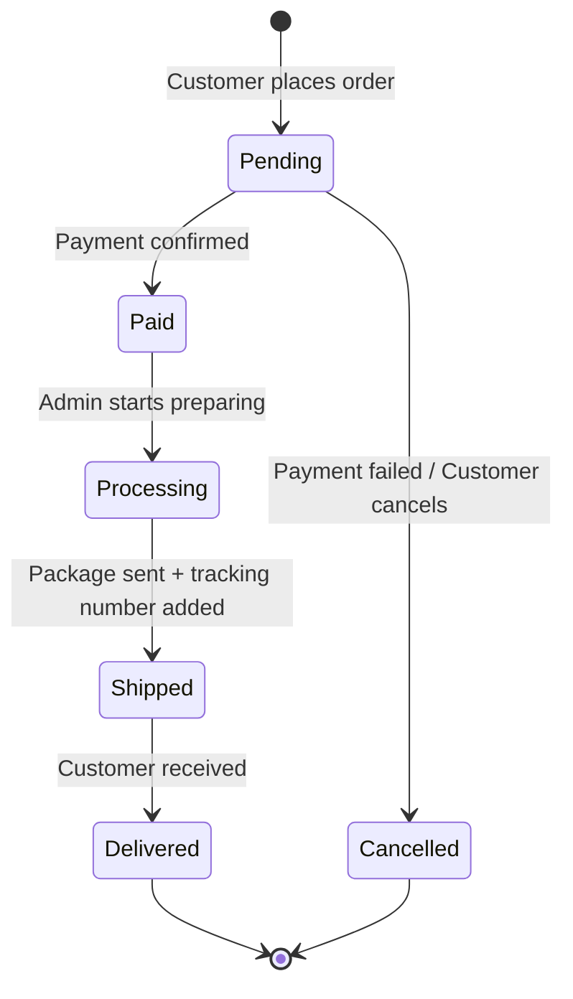
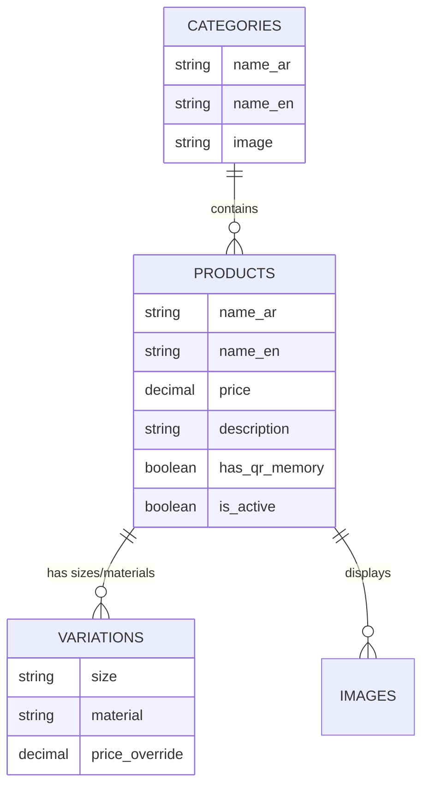
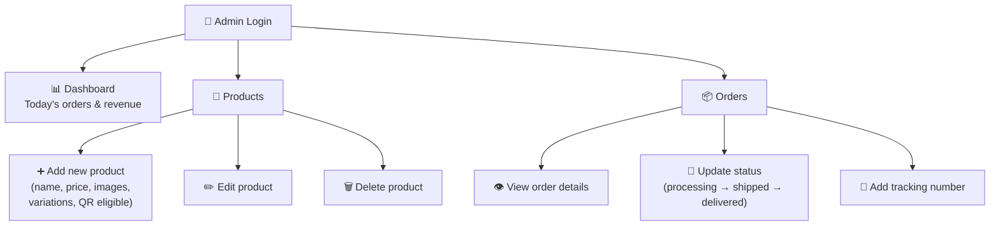
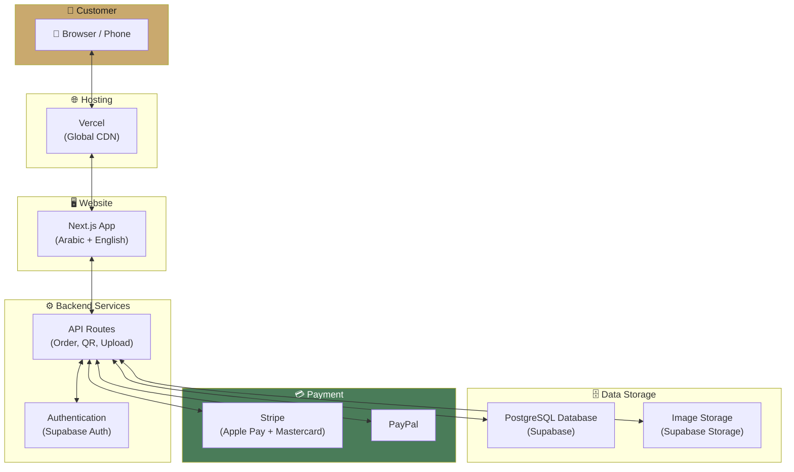
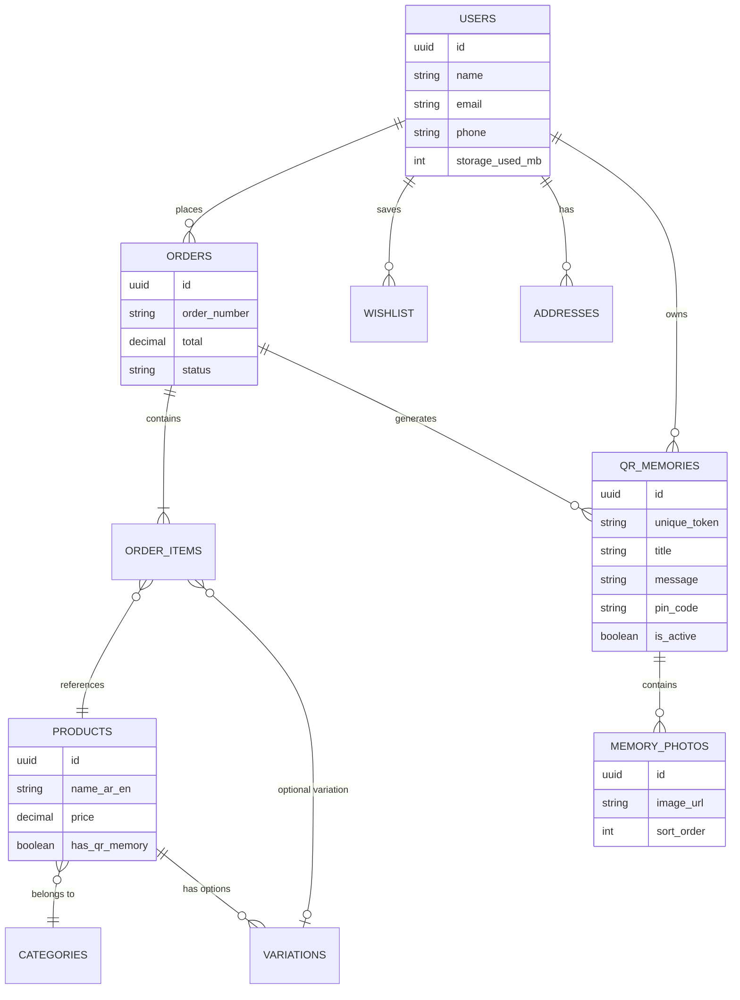

# Hekaya Jewellery — Complete Project Workflow

> **مجوهرات حكاية — "في كل قطعة… حكاية"**
> A children's Jewellery e-commerce platform with a unique QR Memory system.
> This document describes the full business flow, user experience, and system behavior.

---

## 🟢 Implementation Status

A working **frontend-only walkthrough** of every flow described below is live in [`hekaya/`](./hekaya):

```bash
cd hekaya && npm install && npm run dev
```

| Workflow stage                                                      | Implemented | Notes                                                                     |
| ------------------------------------------------------------------- | ----------- | ------------------------------------------------------------------------- |
| Browse → cart → checkout                                            | ✅          | Real cart drawer, cart persisted in `localStorage`                        |
| Order placement                                                     | ✅          | Generates order ID + QR tokens, persisted in Zustand                      |
| QR Memory setup (PIN, photos, message)                              | ✅          | Photos stored as data-URLs (mock)                                         |
| QR Memory unlock + edit                                             | ✅          | 4-digit PIN gate                                                          |
| Account dashboard                                                   | ✅          | Mock "demo user" login                                                    |
| Account — Address book CRUD                                         | ✅          | Add/edit/delete addresses, persisted in `localStorage`                    |
| Wishlist                                                            | ✅          | Heart icon on `ProductCard` toggles persisted store; live list in account |
| Admin (dashboard / products / collections / orders / QR / settings) | ✅          | All in-memory + persisted store data                                      |
| Real authentication                                                 | ❌          | Skipped per current scope                                                 |
| Real payment processing                                             | ❌          | Stripe/PayPal are visual choices only                                     |
| Supabase backend                                                    | ❌          | Storage is `localStorage` for now                                         |

---

## 1. What is Hekaya Jewellery?

Hekaya Jewellery is a **bilingual (Arabic/English)** online Jewellery store targeting the **UAE market**. The store primarily sells **children's Jewellery** but also serves all age groups.

Every eligible Jewellery piece comes with a **unique QR Memory code** — a physical card containing a QR code that unlocks a private digital memory page. Parents scan the QR, upload photos and a heartfelt message, and create a keepsake that lasts forever.

**What makes this different from any other Jewellery store:**

| Normal Jewellery Shop            | Hekaya Jewellery                      |
| -------------------------------- | ------------------------------------- |
| Customer buys → Customer forgets | Customer buys → Receives QR card      |
| No emotional connection          | Scans QR → Uploads precious photos    |
| One-time purchase                | Creates a memory they revisit forever |
| No reason to come back           | Emotional bond → Returns to buy again |

---

## 2. Customer Shopping Journey



---

## 3. QR Memory System — The Core Feature

### 3.1 How QR Codes Are Created

At checkout, the customer chooses whether to add a QR Memory to their order:

- **Per order** — One QR code for the entire order
- **Per piece** — A separate QR code for each Jewellery piece

After payment is confirmed, the system:

1. Generates a unique token (random 8-character code)
2. Creates a QR code image pointing to `hekaya-Jewellery.com/memory/[token]`
3. Stores the QR in the database as **inactive** (no memories yet)
4. QR code is printed on a physical card and placed inside the Jewellery packaging

### 3.2 How QR Memories Work



### 3.3 Memory Page Content

Each memory page contains:

| Element     | Details                                       | Limit          |
| ----------- | --------------------------------------------- | -------------- |
| **Photos**  | High-quality images, compressed automatically | Max 3 photos   |
| **Title**   | Short heading (e.g. "يوم ميلاد ليان")         | 100 characters |
| **Message** | Heartfelt text from the parent                | 500 characters |
| **PIN**     | 4-digit code to protect privacy               | Required       |

### 3.4 QR Properties

| Property         | Value                           |
| ---------------- | ------------------------------- |
| Expires?         | Never                           |
| Editable?        | Yes — owner can update anytime  |
| Who can view?    | Anyone with the PIN             |
| Who can edit?    | Only the owner (logged in)      |
| Max photos       | 3 per memory                    |
| Cost to customer | Included with eligible products |

---

## 4. Website Pages

### 4.1 Customer-Facing Pages



### 4.2 Admin Pages

| Page            | What admin does there                                                     |
| --------------- | ------------------------------------------------------------------------- |
| **Dashboard**   | Today's orders, revenue, 12-month trend chart, status breakdown           |
| **Products**    | Add, edit, delete products and their variations (size/material)           |
| **Collections** | Create / edit / reorder / delete collections                              |
| **Orders**      | View all orders, update status (processing → shipped → delivered)         |
| **QR**          | Every generated QR token with status (generated / set up / pending)       |
| **Settings**    | Store info · QR config · Per-emirate shipping rates · Email notifications |

---

## 5. Payment Flow

### 5.1 Payment Providers: Stripe + PayPal

| Detail         | Value                                                                            |
| -------------- | -------------------------------------------------------------------------------- |
| **Methods**    | **Apple Pay**, **Mastercard**, **PayPal**                                        |
| **Providers**  | Stripe (Apple Pay + Mastercard) · [PayPal](https://paypal.com) (PayPal balances) |
| **Currency**   | AED only                                                                         |
| **Fees**       | Stripe ~2.9% + 1 AED · PayPal ~3.9% + fixed AED                                  |
| **Settlement** | Stripe 2-7 business days to UAE bank · PayPal immediate to balance               |
| **Test mode**  | Stripe test keys · PayPal sandbox                                                |
| **COD**        | Not supported — online payment only                                              |

### 5.2 Checkout Steps



### 5.3 Shipping

- Customer pays **actual shipping cost** (calculated at checkout based on location within UAE)
- No free shipping threshold
- No COD — online payment only

---

## 6. Order Lifecycle



| Status         | Who triggers it         | What happens                             |
| -------------- | ----------------------- | ---------------------------------------- |
| **Pending**    | System (auto)           | Order created, awaiting payment          |
| **Paid**       | Stripe / PayPal webhook | Payment confirmed                        |
| **Processing** | Admin                   | Order being prepared                     |
| **Shipped**    | Admin                   | Tracking number added, customer notified |
| **Delivered**  | Admin                   | Order complete                           |
| **Cancelled**  | System or Admin         | Payment failed or manual cancel          |

---

## 7. Product Catalog

### 7.1 Product Structure



### 7.2 Product Features

| Feature                   | Details                                                                |
| ------------------------- | ---------------------------------------------------------------------- |
| **Categories**            | Organized by type (rings, necklaces, bracelets, etc.) with AR/EN names |
| **Variations**            | Size and material options per product, each can have its own price     |
| **QR Badge**              | Products eligible for QR Memory show a special badge                   |
| **Bilingual**             | All product info in both Arabic and English                            |
| **No inventory tracking** | Products don't track stock counts                                      |

---

## 8. User Account

When a customer logs in, they can access:

| Section            | What they see                                |
| ------------------ | -------------------------------------------- |
| **My Orders**      | List of all past orders with status tracking |
| **My QR Memories** | All their QR memory pages, with edit access  |
| **My Addresses**   | Saved shipping addresses for faster checkout |
| **Wishlist**       | Saved products they want to buy later        |

---

## 9. Admin Dashboard

Two roles can access the admin area: **Owner** and **Store Manager**.

### What admin can do:



---

## 10. System Architecture (High-Level)



---

## 11. Data Model (Simplified)



**Tables summary:**

| Table                | Purpose                             |
| -------------------- | ----------------------------------- |
| `profiles`           | User accounts (extends auth)        |
| `categories`         | Product categories (AR/EN)          |
| `products`           | Product catalog (AR/EN)             |
| `product_variations` | Size/material options per product   |
| `orders`             | Customer orders                     |
| `order_items`        | Items within each order             |
| `qr_memories`        | QR code data + memory content       |
| `memory_photos`      | Photos attached to memories (max 3) |
| `wishlist`           | User's saved products               |
| `addresses`          | User's saved shipping addresses     |

**Total: 10 tables** (clean, no unnecessary complexity)

---

## 12. Cost Breakdown

### Monthly Operating Cost

| Phase      | Monthly Cost        | When                            |
| ---------- | ------------------- | ------------------------------- |
| **Launch** | **$0/month**        | Day 1 — First 3 months          |
| **Growth** | **~$45/month**      | When traffic exceeds free tiers |
| **Scale**  | **~$100-200/month** | 20,000+ visitors/month          |

### Service Costs

| Service                   | Launch (Free)        | Growth               | Purpose                     |
| ------------------------- | -------------------- | -------------------- | --------------------------- |
| Vercel (Hosting)          | $0                   | $20/mo               | Website hosting + CDN       |
| Supabase (Database)       | $0                   | $25/mo               | Database + Auth             |
| Supabase Storage (Images) | $0                   | Pay-per-use          | Photo storage               |
| Stripe (Apple Pay + MC)   | ~2.9% + 1 AED/tx     | ~2.9% + 1 AED/tx     | Card + Apple Pay processing |
| PayPal                    | ~3.9% + fixed AED/tx | ~3.9% + fixed AED/tx | PayPal balances             |
| Domain                    | ~$12/year            | ~$12/year            | hekaya-Jewellery.com        |

### First Year Total: ~$12 (domain only) + payment processing fees

---

## 13. Technology Summary

| Layer         | Technology            | Why                                                           |
| ------------- | --------------------- | ------------------------------------------------------------- |
| Website       | Next.js (React)       | Fast, SEO-friendly, bilingual support                         |
| Language      | TypeScript            | Catches bugs early                                            |
| Database      | Supabase (PostgreSQL) | Free tier, built-in auth, real-time                           |
| Auth          | Supabase Auth         | Email/password registration                                   |
| Image Storage | Supabase Storage      | Seamless integration with Supabase Auth                       |
| Payments      | Stripe + PayPal       | Apple Pay & Mastercard via Stripe; PayPal balances via PayPal |
| QR Generation | qrcode library        | Generates QR code images                                      |
| Hosting       | Vercel                | Free, global CDN, auto-deploy                                 |
| Bilingual     | next-intl             | Full Arabic/English support                                   |

---

## 14. Key Business Decisions (Confirmed)

| Decision           | Answer                                                                |
| ------------------ | --------------------------------------------------------------------- |
| Target market      | UAE only                                                              |
| Currency           | AED only                                                              |
| Languages          | Arabic (default) + English                                            |
| Payment            | Stripe + PayPal — Apple Pay, Mastercard, PayPal (online only, no COD) |
| QR per             | Customer chooses: per order or per piece                              |
| Memory content     | 3 photos + title + message                                            |
| Memory privacy     | 4-digit PIN required to view                                          |
| Memory editing     | Owner can edit anytime (login required)                               |
| Product variations | Yes (size, material, price override)                                  |
| Inventory tracking | No                                                                    |
| Shipping           | Customer pays actual cost                                             |
| Reviews system     | No                                                                    |
| Coupon system      | No                                                                    |
| Admin roles        | Owner + Store Manager                                                 |

---

<p align="center">
  <strong>Hekaya Jewellery</strong> — مجوهرات حكاية<br>
  "A Story in Every Piece" / "في كل قطعة… حكاية"<br><br>
  <em>Document prepared for project approval</em>
</p>
